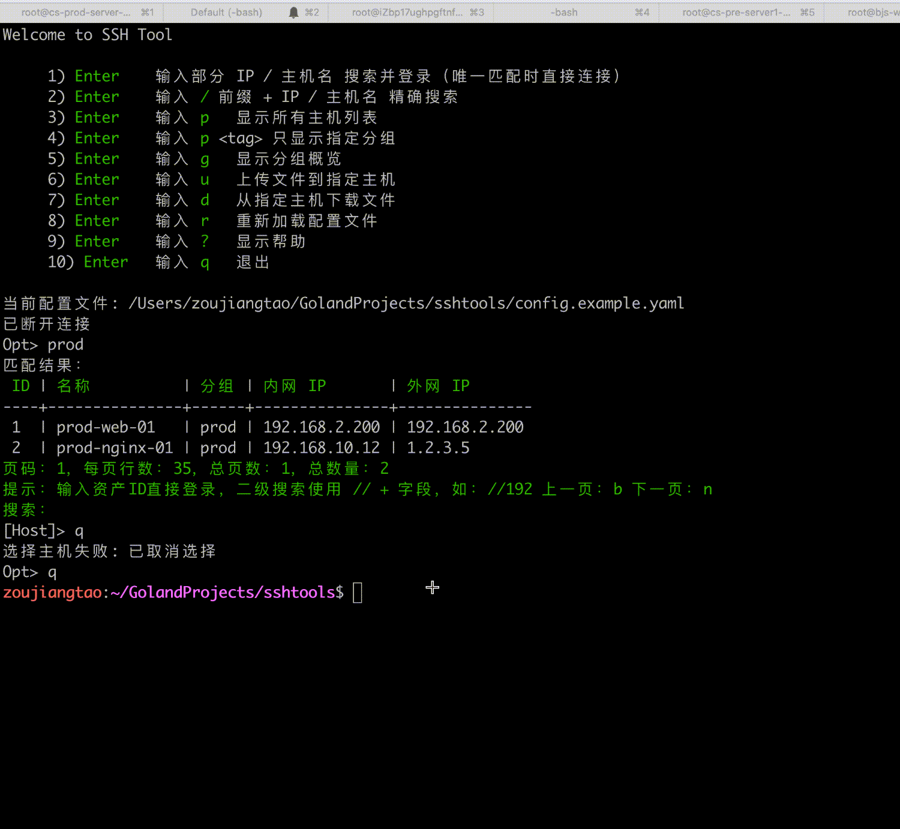

# SSH Tools

`sshtools` 是一个面向多主机场景的命令行 SSH 管理工具，交互风格接近 JumpServer，适合运维、开发和测试环境中的日常登录、主机检索、文件上传下载。

## 演示

<p align="center">
  
</p>

## 特性

- 支持主机分组与 `tag` 过滤
- 支持主机名、IP、全局 ID 搜索连接
- 支持密码登录和 SSH 私钥登录
- 支持默认公网 IP / 内网 IP 连接策略
- 支持交互式 SSH 会话
- 支持 SFTP 上传、下载、目录递归传输
- 支持配置热重载
- 支持内嵌默认配置兜底启动

## 适用场景

- 一台终端管理多套环境主机
- 通过关键词快速定位服务器
- 在公网和内网地址之间按规则切换
- 直接在终端里完成上传、下载和登录操作

## 快速开始

### 1. 编译

```bash
go build -o sshtools .
```

### 2. 准备配置

复制示例配置并按实际环境修改：

```bash
cp config.example.yaml config.yaml
```

### 3. 运行

```bash
./sshtools
```

或显式指定配置文件：

```bash
./sshtools --config /path/to/config.yaml
```

## 配置文件查找顺序

程序按以下优先级加载配置：

1. `--config` 指定路径
2. 当前目录 `./config.yaml`
3. 用户目录 `~/.ssh-tool/config.yaml`
4. 内嵌 `default.yaml`

找到第一个可读配置后立即使用，不继续向下查找。

## 配置示例

详细配置请看 [config.example.yaml](config.example.yaml)。

```yaml
default_ip_type: public
ssh_timeout: 15s

groups:
  - name: 生产环境
    tag: prod
    machines:
      - name: prod-web-01
        intranet_ip: 192.168.10.11
        public_ip: 1.2.3.4
        port: 22
        user: root
        private_key_path: ~/.ssh/id_rsa
        private_key_passphrase: ""
        platform: Linux

machines:
  - name: legacy-host-01
    intranet_ip: 192.168.99.10
    public_ip: ""
    port: 22
    user: root
    password: "change-me"
    platform: Linux
```

## 常用命令

| 命令 | 说明 |
|------|------|
| `关键词` | 模糊搜索主机并连接 |
| `/关键词` | 精确搜索主机并连接 |
| `数字` | 按全局 ID 直接连接 |
| `p` | 查看全部主机 |
| `p <tag>` | 查看指定分组 |
| `g` | 查看分组概览 |
| `u` | 上传文件 |
| `d` | 下载文件 |
| `r` | 重新加载配置 |
| `?` | 查看帮助 |
| `q` | 退出 |

## 文档

- [USAGE.md](USAGE.md): 面向使用者的操作手册
- [SPEC.md](SPEC.md): 项目原始需求规格说明
- [config.example.yaml](config.example.yaml): 示例配置文件

## 开源建议

如果你要在团队内或公开环境使用，建议：

- 不要提交真实的 `config.yaml`
- 使用 `config.example.yaml` 作为模板
- 使用私钥登录替代明文密码
- 为不同环境使用明确的分组和 `tag`

## License

本项目使用 [MIT License](LICENSE)。
